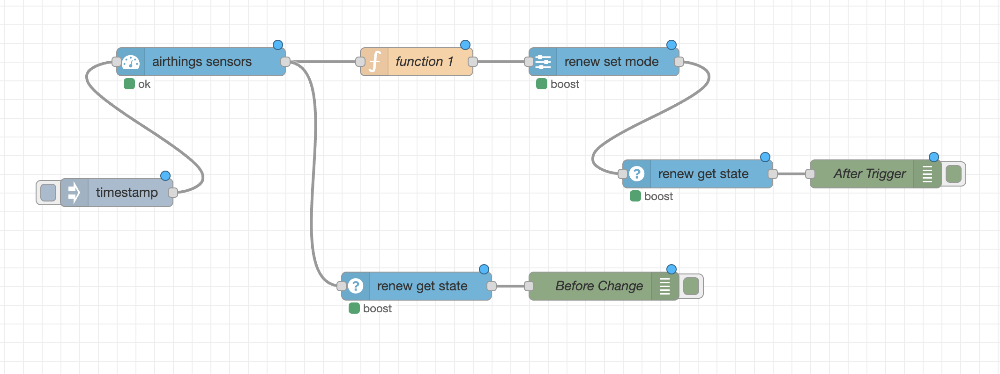

# node-red-contrib-airthings

<p align="center">
  <a href="https://buymeacoffee.com/airdavid">
    
  </a>
</p>

<p align="center"><em>Built and maintained independently. If this saves you time, a coffee keeps it alive.</em></p>

---

> **Your air quality data. Your automations. Fully wired into Node-RED.**

Node-RED nodes for the [Airthings Consumer API](https://consumer-api-doc.airthings.com/) — poll sensor readings from your Airthings devices and control the Renew air purifier directly from your flows.

---

## See it in action

**Poll temperature → boost the purifier when air quality drops. Confirm the state before and after.**



The flow above reads sensor data on a schedule, runs it through a function node that checks temperature, sets the Renew to BOOST or AUTO accordingly, then confirms the new state with a get-state node — all in a handful of wires.

---

## Nodes

| Node | Description |
|------|-------------|
| **airthings-config** | Shared credentials (Client ID + Secret) |
| **airthings-sensors** | Fetch latest sensor readings from your devices |
| **airthings-devices** | List all devices connected to your account |
| **airthings-renew-get** | Get the current mode of a Renew air purifier |
| **airthings-renew-set** | Set the mode of a Renew air purifier |

## Setup

### 1. Create an API client

Go to [consumer-api-doc.airthings.com/dashboard](https://consumer-api-doc.airthings.com/dashboard) and create an OAuth client. Copy the **Client ID** and **Client Secret**.

### 2. Add the config node

In Node-RED, add an **airthings-config** node and enter your Client ID and Client Secret. Account ID is optional — it will be auto-detected from your account.

### 3. Add nodes to your flow

All nodes take any input message as a trigger. Sensor data and device state are returned on `msg.payload`.

## Node reference

### airthings-sensors

Fetches the latest readings from your Airthings devices. Select which devices to include using the checkboxes in the node editor (all checked = fetch all). Each device is queried individually so a single unresponsive device won't block the rest.

**Inputs**

| Property | Type | Description |
|----------|------|-------------|
| `payload` | any | Triggers a fetch |
| `unit` _(optional)_ | string | `"metric"` (default) or `"imperial"` |
| `serialNumbers` _(optional)_ | string[] | Override the node's device selection at runtime |

**Output** — `msg.payload` is a flat object keyed by serial number:
```json
{
  "2930001150": {
    "sensors": { "co2": 642, "temp": 27.4, "humidity": 51, "voc": 105, "pressure": 1010 },
    "recorded": "2026-06-28T17:42:50",
    "batteryPercentage": 100
  },
  "4100000915": {
    "sensors": { "pm25": 3.0 },
    "recorded": "2026-06-28T17:50:32",
    "batteryPercentage": null
  },
  "2930024040": { "error": "API error (504)..." }
}
```

Devices that fail individually appear with an `error` key — the rest still populate normally. To act on a specific sensor value in a downstream Switch or Function node:

```javascript
msg.payload["2930001150"].sensors.temp  // → 27.4
msg.payload["4100000915"].sensors.pm25  // → 3.0
```

### airthings-devices

Lists all devices on the account, including their sensor capabilities. Useful for discovering serial numbers.

**Output** — `msg.payload`:
```json
{
  "devices": [
    {
      "serialNumber": "4200012345",
      "name": "Living Room",
      "type": "WAVE_PLUS",
      "home": "Home",
      "sensors": ["co2", "humidity", "pressure", "radon", "temp", "voc"]
    }
  ]
}
```

### airthings-renew-get

Gets the last reported mode of a **Renew (AP_1)** air purifier. Select your Renew device from the dropdown in the node editor (only AP_1 devices are shown).

**Input** — set `msg.serialNumber` at runtime to override the node's selected device.

**Output** — `msg.payload`:
```json
{ "mode": "AUTO" }
{ "mode": "MANUAL", "fanSpeed": 3 }
```

### airthings-renew-set

Sets the operational mode of a **Renew (AP_1)** air purifier. Select your device from the dropdown in the node editor. The command is forwarded asynchronously — use **airthings-renew-get** to confirm the device has applied it.

**Input** — `msg.payload` can be:
- A mode string: `"AUTO"`, `"OFF"`, `"SLEEP"`, `"BOOST"`, or `"MANUAL"`
- An object: `{ "mode": "MANUAL", "fanSpeed": 3 }` (fanSpeed 1–5 required for MANUAL)

Set `msg.serialNumber` at runtime to override the node's selected device.

| Mode | Description |
|------|-------------|
| `OFF` | Turn off |
| `AUTO` | Automatic — adjusts speed based on built-in PM sensor |
| `SLEEP` | Quiet low speed for 8 hours (23 dB) |
| `BOOST` | Maximum speed for 60 minutes |
| `MANUAL` | Fixed fan speed — set `fanSpeed` 1 (quietest) to 5 (highest) |

**Output** — `msg.payload` echoes the applied command:
```json
{ "mode": "MANUAL", "fanSpeed": 3 }
```

## Example: boost the Renew when it's too warm

Wire up: **inject (every 5 min) → airthings-sensors → function → airthings-renew-set**

In the **Function** node:

```javascript
const sn = "2960000310"; // Tv Cabinet VIEW_PLUS · 2960000310
const temp = msg.payload[sn]?.sensors?.temp;

if (temp === undefined) return null; // device didn't respond — do nothing

msg.payload = temp > 20 ? { mode: "BOOST" } : { mode: "AUTO" };
return msg;
```

`return null` drops the message silently if the sensor didn't respond, so the Renew is never touched on a bad reading. Swap the serial number for whichever of your devices has a temperature sensor.

## Requirements

- Node.js 14 or later
- Node-RED 2.0 or later

## License

MIT

---

## Support this project

I built and maintain this as a personal project in my own time. If it's useful to you and you'd like to help keep it alive, a coffee goes a long way — it's the most direct way to support independent open-source work like this.

**[☕ Buy me a coffee](https://buymeacoffee.com/airdavid)**

Bug reports, feature requests, and pull requests are all welcome on [GitHub](https://github.com/devdavidkarlsson/node-red-contrib-airthings).
